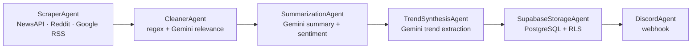

**English** · [Tiếng Việt](README.md)

# AI Trend Agent

An async ETL pipeline that collects AI news from multiple sources, cleans and analyzes it with Google Gemini, stores it in Supabase PostgreSQL, and publishes to Discord — containerized and scheduled on Kubernetes.

> Python 3.13 · async/await · Factory + Strategy + Pipeline · Docker multi-stage · Kubernetes CronJob · 13 ADRs

---

## What it does

On each cycle (default: every 4 hours), the agent runs exactly one ETL pass and exits:



A real cycle (measured in-container): ~49 seconds, 12 raw articles → 10–11 cleaned, 4 Gemini calls, one Supabase write, 4 Discord messages.

The pipeline distinguishes **critical** agents (failure → stop the cycle, never publish unsaved data) from **enrichment** agents (failure → degrade, keep going). `ScraperAgent` and `SupabaseStorageAgent` are critical; Gemini hitting its quota only downgrades summaries to a fallback — it does not kill the cycle.

---

## Engineering highlights

The value here isn't "call Gemini to summarize news" — it's how a system that actually runs was diagnosed and hardened:

- **Caught a container that had never booted.** The Dockerfile installed the wrong SDK (`google-generativeai`) while the code imports `google-genai` → the image died on the first `import`. The bug survived because a successful `import` doesn't prove the code runs — and no static CI gate (Gitleaks/Semgrep/Trivy) *runs* the program. → [ADR 0008](knowledge/decisions/0008-container-runtime-correctness.md)

- **Redacted secrets from logs while keeping the diagnostic line.** `httpx` printed the full Discord webhook URL 4× per cycle. Rejected the easy fix (silencing `httpx` logs) because it would also kill the `Reddit "403 Blocked"` line — the very line that revealed Reddit was down. Built a `logging.Filter` attached at the handler layer instead. → [ADR 0009](knowledge/decisions/0009-secret-hygiene.md)

- **Locked down a world-writable PostgreSQL table.** The table ran on an anon key with RLS off → anyone with the URL could write. Switched to a secret key and enabled Row Level Security. Verified **without a destructive command**: `INSERT ... ON CONFLICT DO NOTHING` on an existing url, not a full-table `DELETE`. → [ADR 0010](knowledge/decisions/0010-supabase-rls-secret-key.md)

- **Real exit codes on Kubernetes.** Replaced `Deployment` + `while True` with a one-shot `CronJob`: a failed cycle → `exit 1` → Job `Failed`; a full cycle → `exit 0` → `Succeeded`. K8s can tell success from failure instead of a pod that lives forever showing a false green. Verified both paths on a real cluster. → [ADR 0011](knowledge/decisions/0011-cronjob-oneshot.md)

- **Diagnosed "Invalid API key" layer by layer.** A raw REST call returned `200` (key is valid) while `supabase-py` errored → isolated the failure to `create_client()` in version 2.11.0 (rejects the new key format). Upgraded to 2.31.0. Ruled out a CRLF hypothesis by comparing secret lengths **without ever printing the secret**. → [ADR 0012](knowledge/decisions/0012-supabase-client-upgrade.md)

Every major decision is recorded in [`knowledge/decisions/`](knowledge/decisions/) (13 ADRs).

---

## Architecture

**Factory + Strategy + Pipeline.** Each agent self-registers with the Factory via a decorator, so adding an agent/source requires **no change** to the orchestrator (OCP):

```python
@AgentFactory.register("scraper")
class ScraperAgent(BaseAgent):
    is_critical = True
    async def execute(self, ctx: PipelineContext) -> PipelineContext: ...
```

Layered structure: `Domain` (pure dataclasses + config) → `Application` (BaseAgent, Factory, decorators) → `Infrastructure` (I/O: scraper, cleaner, AI, storage, publisher) → `WebApi` (orchestrator).

---

## Tech stack

| Area | Technology |
|---|---|
| Language | Python 3.13 (async/await) |
| HTTP | `httpx` + `asyncio.gather` |
| AI | Google Gemini (`google-genai`) — summary, sentiment, trend synthesis, relevance scoring |
| Database | Supabase PostgreSQL + Row Level Security |
| Publisher | Discord webhook |
| Container | Docker multi-stage (builder + runtime, non-root) |
| Orchestration | Kubernetes CronJob (verified on Docker Desktop Kubeadm) |

---

## Running it

### Local (venv)

```bash
python -m venv .venv
.venv\Scripts\activate          # Windows
pip install -r Backend/requirements.txt
# create Backend/.env with NEWS_API_KEY, GEMINI_API_KEY, SUPABASE_URL, SUPABASE_KEY, DISCORD_WEBHOOK_URL
pip install -e .
ai-trend-worker
```

No `TOPIC` set → it prompts for a topic. `TOPIC` set → runs that topic once and exits.

### Docker

```bash
docker build -t ai-trend-agent:v4 .
docker run --rm --env-file Backend/.env -e TOPIC="Blockchain" ai-trend-agent:v4
```

### Kubernetes

```bash
kubectl apply -f k8s/00-namespace.yaml -f k8s/02-configmap.yaml
# create the Secret from .env (see k8s/01-secret.yaml.template)
kubectl apply -f k8s/03-deployment.yaml   # CronJob
```

---

## Project structure

```
Backend/
└── src/ai_trend_agent/
    ├── domain/          # models.py, config.py (centralized constants)
    ├── application/     # base_agent.py (Factory), decorators, log_redaction
    ├── infrastructure/  # scrapers, cleaner, ai_agent, trend_agent,
│                                   #   supabase_storage, discord_agent
    ├── worker/main.py   # orchestrator (one-shot)
    └── (tests: Backend/tests/)           # pytest + eval suite
Dockerfile · k8s/ · knowledge/decisions/ (13 ADRs) · docs/
```

---

## Known limitations

Stated plainly, not hidden:

- **Gemini is on the free tier** (20 requests/day). Each cycle costs 4 calls → ~5 cycles/day before hitting `429`. When the quota runs out the pipeline degrades correctly (Gemini is enrichment), it does not crash.
- **Reddit currently uses the public channel** → often `403`. Needs `REDDIT_CLIENT_ID`/`SECRET` for OAuth; currently runs 2 of 3 sources.
- The `date` column still mixes formats (RFC822 / ISO / `N/A`) — needs normalizing to `timestamptz`.
- Runtime is currently verified on a local cluster (Kubeadm); not yet deployed to always-on infrastructure.

Roadmap for the above: [`docs/03-engineering/hardening-plan.md`](docs/03-engineering/hardening-plan.md).
