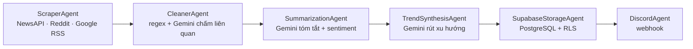

[English](README.en.md) · **Tiếng Việt**

# AI Trend Agent

Pipeline ETL bất đồng bộ tự động thu thập tin AI từ nhiều nguồn, làm sạch và phân tích bằng Google Gemini, lưu vào Supabase PostgreSQL, và phát hành qua Discord — đóng gói chạy trên Kubernetes theo lịch.

> Python 3.13 · async/await · Factory + Strategy + Pipeline · Docker multi-stage · Kubernetes CronJob · 13 ADR

---

## Nó làm gì

Mỗi chu kỳ (mặc định 4 giờ/lần), agent chạy đúng một lượt ETL rồi thoát:



Một chu kỳ thật (đo trong container): ~49 giây, 12 bài thô → 10–11 bài sạch, 4 lời gọi Gemini, ghi Supabase, gửi 4 tin nhắn Discord.

Pipeline phân biệt agent **critical** (lỗi → dừng chu kỳ, không đăng dữ liệu chưa lưu) và **enrichment** (lỗi → degrade, vẫn tiếp tục). Ví dụ: `ScraperAgent` và `SupabaseStorageAgent` là critical; Gemini hết quota chỉ làm tóm tắt xuống bản dự phòng, không giết chu kỳ.

---

## Điểm kỹ thuật đáng chú ý

Giá trị của repo này không nằm ở "gọi Gemini tóm tắt tin" — mà ở cách chẩn đoán và làm cứng một hệ thống chạy thật:

- **Bắt được container chưa từng khởi động.** Dockerfile cài nhầm SDK (`google-generativeai`) trong khi code dùng `google-genai` → image chết ở dòng `import` đầu tiên. Lỗi lọt qua vì `import` thành công không chứng minh code chạy — và không cổng CI tĩnh nào (Gitleaks/Semgrep/Trivy) *chạy* chương trình. → [ADR 0008](knowledge/decisions/0008-container-runtime-correctness.md)

- **Che secret trong log mà giữ dòng chẩn đoán.** `httpx` in nguyên URL webhook Discord 4 lần/chu kỳ. Từ chối cách sửa dễ (tắt log `httpx`) vì nó cũng giết dòng `Reddit "403 Blocked"` — dòng phát hiện Reddit chết. Thay bằng `logging.Filter` gắn ở tầng handler. → [ADR 0009](knowledge/decisions/0009-secret-hygiene.md)

- **Khoá bảng PostgreSQL đang world-writable.** Bảng chạy anon key + RLS tắt → ai có URL cũng ghi được. Chuyển sang secret key + bật Row Level Security. Kiểm chứng **không dùng lệnh phá huỷ**: `INSERT ... ON CONFLICT DO NOTHING` trên url đã tồn tại, thay vì `DELETE` toàn bảng. → [ADR 0010](knowledge/decisions/0010-supabase-rls-secret-key.md)

- **Exit code thật trên Kubernetes.** Đổi `Deployment` + `while True` → `CronJob` one-shot: chu kỳ lỗi → `exit 1` → Job `Failed`; chu kỳ đủ → `exit 0` → `Succeeded`. K8s biết được thành/bại thay vì pod sống mãi báo xanh giả. Verify cả hai chiều trên cluster thật. → [ADR 0011](knowledge/decisions/0011-cronjob-oneshot.md)

- **Chẩn đoán "Invalid API key" theo tầng.** REST thô trả `200` (key hợp lệ) nhưng `supabase-py` báo lỗi → cô lập được vào `create_client()` của bản 2.11.0 (chối định dạng key mới). Nâng lên 2.31.0. So độ dài secret để loại giả thuyết CRLF **mà không in secret ra log**. → [ADR 0012](knowledge/decisions/0012-supabase-client-upgrade.md)

Toàn bộ quyết định lớn ghi trong [`knowledge/decisions/`](knowledge/decisions/) (13 ADR).

---

## Kiến trúc

Pattern **Factory + Strategy + Pipeline**. Mỗi agent tự đăng ký vào Factory bằng decorator, nên thêm agent/nguồn **không sửa** orchestrator (OCP):

```python
@AgentFactory.register("scraper")
class ScraperAgent(BaseAgent):
    is_critical = True
    async def execute(self, ctx: PipelineContext) -> PipelineContext: ...
```

Phân lớp chuẩn: `Domain` (dataclass + config thuần) → `Application` (BaseAgent, Factory, decorator) → `Infrastructure` (I/O: scraper, cleaner, AI, storage, publisher) → `WebApi` (orchestrator).

---

## Tech stack

| Mảng | Công nghệ |
|---|---|
| Ngôn ngữ | Python 3.13 (async/await) |
| HTTP | `httpx` + `asyncio.gather` |
| AI | Google Gemini (`google-genai`) — summary, sentiment, trend synthesis, relevance scoring |
| Database | Supabase PostgreSQL + Row Level Security |
| Publisher | Discord webhook |
| Container | Docker multi-stage (builder + runtime, non-root) |
| Orchestration | Kubernetes CronJob (verify trên Docker Desktop Kubeadm) |

---

## Chạy thử

### Local (venv)

```bash
python -m venv .venv
.venv\Scripts\activate          # Windows
pip install -r Backend/requirements.txt
# tạo Backend/.env với NEWS_API_KEY, GEMINI_API_KEY, SUPABASE_URL, SUPABASE_KEY, DISCORD_WEBHOOK_URL
python Backend/ai_trend_agent.WebApi/main.py
```

Không set `TOPIC` → nó hỏi chủ đề. Set `TOPIC` → chạy chủ đề đó rồi thoát.

### Docker

```bash
docker build -t ai-trend-agent:v4 .
docker run --rm --env-file Backend/.env -e TOPIC="Blockchain" ai-trend-agent:v4
```

### Kubernetes

```bash
kubectl apply -f k8s/00-namespace.yaml -f k8s/02-configmap.yaml
# tạo Secret từ .env (xem k8s/01-secret.yaml.template)
kubectl apply -f k8s/03-deployment.yaml   # CronJob
```

---

## Cấu trúc

```
Backend/
├── ai_trend_agent.Domain/          # models.py, config.py (hằng số tập trung)
├── ai_trend_agent.Application/     # base_agent.py (Factory), decorators, log_redaction
├── ai_trend_agent.Infrastructure/  # scrapers, cleaner, ai_agent, trend_agent,
│                                   #   supabase_storage, discord_agent
├── ai_trend_agent.WebApi/main.py   # orchestrator (one-shot)
└── ai_trend_agent.Tests/           # pytest + eval suite
Dockerfile · k8s/ · knowledge/decisions/ (13 ADR) · docs/
```

---

## Giới hạn đã biết:

- **Gemini đang ở free tier** (20 request/ngày). Mỗi chu kỳ tốn 4 lời gọi → tối đa ~5 chu kỳ/ngày trước khi `429`. Khi hết quota pipeline degrade đúng (Gemini là enrichment), không sập.
- **Reddit đang chạy kênh công khai** → thường bị `403`. Cần `REDDIT_CLIENT_ID`/`SECRET` để dùng OAuth; hiện chạy 2/3 nguồn.
- Cột `date` còn lẫn nhiều định dạng (RFC822 / ISO / `N/A`) — cần chuẩn hoá về `timestamptz`.
- Runtime hiện verify trên cluster local (Kubeadm); chưa deploy lên hạ tầng chạy 24/7.

Lộ trình xử lý các mục trên: [`docs/03-engineering/hardening-plan.md`](docs/03-engineering/hardening-plan.md).
